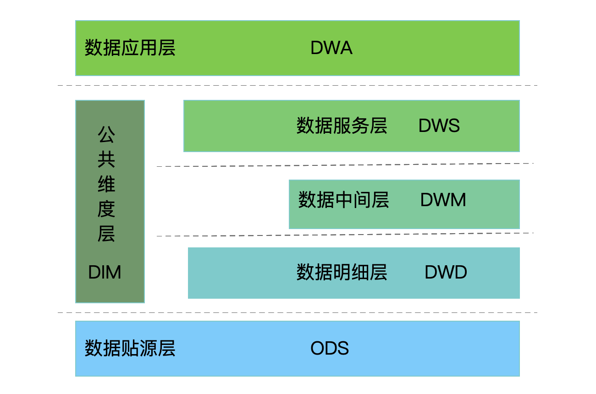

#### 一. 数据仓库
&emsp;&emsp;数据仓库（Data Warehouse, DW）是一个面向主题的、集成的、随时间变化的、但信息本身相对稳定的数据集合，用于对管理决策过程的支持。业界主要从两个方面来进行命名：
* ①. 从大方向来讲叫企业数据仓库（EDW）,或者数据湖（Data Lake）等;
* ②. 从面向业务，主题来讲，如用户数据仓库(User Data Warehouse, UDW), 用户画像数据仓库(User Profile Data Warehouse, UPDW)等。

#### 二. 数据仓库建模
&emsp;&emsp;目前数据仓库建模主要建模是Inmon提出的ER模型，Kimball的维度模型，Data Vault模型和基于Data Vault的Anchor 模型。
##### 1. ER模型
&emsp;&emsp;Inmon提出的企业级数据仓库模型采用三范式（3NF），即ER模型。若从企业级数据仓库模型着手，走的就是一条自顶向下的建设途径：先建企业级数据仓库，再在其上开发具体的应用。在缺乏足够的技术力量和数据仓库建设经验的情况下，按照这种模型设计的系统建设过程长，周期长，难度大，风险大，容易失败。

这种模型的优点是信息全面、系统灵活、数据冗余少。

##### 2. 维度模型
&emsp;&emsp;维度模型也叫星型模型，Kimball提出的多维模型降低了范式化，走的是总线型结构（自下而上和自上而下混合），以分析主题为基本框架来组织数据。以维度模型开发分析主题，这样能够快速实施，迅速获得投资回报，在取得实际效果的基础上，再逐渐增加应用主题，循序渐进，积累经验，逐步建成企业级数据仓库。

这种模型的优点是查询速度快，做报表也快；缺点是由于存在大量的预处理，其建模过程相对来说就比较慢。当业务问题发生变化，原来的维不能满足要求时，需要增加新的维。由于事实表的主键由所有维表的主键组成，所以这种维的变动将是非常复杂、非常耗时的。而且信息不够全面、系统欠灵活、数据冗余多。
##### 3. Data Vault模型
&emsp;&emsp;Data Vault 是 Dan Linstedt 发起创建的一种模型，它是ER模的衍生，其设计的出发点也是为了实现数据的整合，但不能直接用于数据分析决策。它强调建立一个可审计的基础数据层，也就是强调数据的历史性、可追溯性和原子性，而不要求对数据进行过度的一致性处理和整合同时它基于主题概念将企业数据进行结构化组织，
并引入了更进一步的范式处理来优化模型，以应对游源系统变更的扩展性。 Data Vault 型由Hub, Link, Satellite三部分组成，比ER模型更容易设计和产出，Hub 可以想象成人的骨架，那么Link 就是连接骨架的韧带，而Satellite就是骨架上面的血肉。详细信息可以参考这篇文章的介绍：
https://blog.csdn.net/junweishiwo/article/details/82838407

&emsp;&emsp;其中对于ER模型，维度模型，Data Vault模型的开发说明可以参考这篇文章：https://blog.csdn.net/wzy0623/article/details/50315719
##### 4. Anchor 模型
&emsp;&emsp;Anchor对Data Vault 模型做了进一步规范化处理，初衷是设计一个高度可扩展的模型，其核心思想是所有的扩展只是添加而不是修改，因此将模型规范到 6NF ，基本变成了 k-v 结构化模型。Anchor 模型组成是：
* ①. Anchors，类似于 Data Vault Hub ，代表业务实体，且只有主键;
* ②. Attributes，功能类似于 Data Vault Satellite ，但是它更加规范化，将其全部 k-v 结构化， 一个表只有一个Anchors 的属性描述;
* ③. Ties，就是 Anchors 之间的关系，单独用表来描述，类似于 Data Vault Link ，可以提升整体模型关系的扩展能力;
* ④. Knot，代表那些可能会在多个Anchors 中公用的属性的提炼，比如性别、状态等这种枚举类型且被公用的属性。

&emsp;&emsp;在上述四个基本对象的基础上，又可以细划分为历史的和非历史的，其中历史的会以时间戳加多条记录的方式记录数据的变迁历史。Anchor 模型的创建者以此方式来获取极大的可扩展性，但是也会增加非常多的查询 join 操作。创建者的观点是，数据仓库中的分析查询只是基于一小部分字段进行的，类似于列存储结构，可以大大减少数据扫描，而从对查询性能影响较小。
####　三. 数据仓库的分层
&emsp;&emsp;基于数据仓库模型理论指导，以数据分析，统计指标为导向，为了能够记录数据的历史，便于处理业务变化，把复杂问题简单化，通过空间换时间提高数据访问效率，数据集成考虑，在数仓实际开发过程中进行分层处理：
* ①. 操作型数据存储层：ODS（Operational Data Store）
&emsp;&emsp;该层也叫贴源表层，通常是将业务系统数据经过抽取，装在到本层，考虑后续可能需要追溯数据问题，因此对于这一层不做过多的数据清洗工作，基本是原始数据，至于数据的清洗，如值转换，去重、异常值处理等过程可以放在后面的DWD层来做。
* ②. 数据明细层：DWD（Data Warehouse Detail）
&emsp;&emsp;DWD一般保持和ODS层一样的数据粒度,都是最小粒度数据，通过清洗处理提供一定的数据质量保证。为了提高在DWD层数据的易用性，表处理的时候进行一些维度退化手法，减少表关联查询，即尽量将事实表的数据扁平化，如通常将dim_user表的一些常用字段填充到fct_event，event中增加尽可能多的用户维度信息。
* ③. 数据中间层：DWM（Data WareHouse Middle）
&emsp;&emsp;DWM是在DWD层的数据基础上，对数据做轻度的聚合操作，生成一系列的中间表，提升公共指标的复用性，减少重复加工。具体情况主要是看数据统计分析或者处理过程，比如用户的订单数目先是按照日统计产生的中间表dwm_user_daily_count, 然后基于dwm_user_daily_count统计周订单或者月订单，通过中间表的方式减少，
但是在去除统计的时候就没有轻度聚合的情况，所以这一层是非必须的。当另外一种不是做指标统计，而是明细数据处理的时候也是在这一层进行处理，如用户画像的标签经常会变，所以在这一层将用户维度表做宽表处理，达到尽可能方便DWS层使用。
* ④. 数据服务层：DWS（Data WareHouse Servce）
&emsp;&emsp;DWS数据集市或宽表，有些公司也叫Data Mart，数据集市层，按照主题如财务，客户管理等划分，或者按照业务划分，如流量、订单等，生成字段比较多的宽表，用于提供后续的业务查询，OLAP分析，数据服务等。在这一层有两种操作，例如面向自主BI类型的，可能需要明细粒度的数据，方便下钻，或者上卷操作。
所以是通过DWD/DWM只是表字段增多，数据粒度没有变的宽表, 可以通过创建视图的方式实现，而不是开发物理表，增加数据存储成本。另外一种是基于上面讲的面向特定运营方向，固定不变的统计分析，如固定报表展示，这一层是统计指标和统计维度比较固定，通过在DWD层加工而成，当然也可以通过DWM层直接加工而成。
* ⑤. 数据应用层：DWA（Data WareHouse Application）
&emsp;&emsp;有些公司也叫APP层，提供给数据展示，数据产品或者OLAP多维数据分析使用的数据，一般是从DWS层导出到MySQL、Redis等系统中供线上系统使用；也可以是基于DWS层表的视图提供给Spark/Presto等自主分析使用。
* ⑥. 公共维度层：DIM（Dimension）
&emsp;&emsp;公共维度层基于维度建模理念，建立整个企业的一致性维度。维度是逻辑概念，是衡量和观察业务的角度。维表是根据维度及其属性将数据平台上构建的表物理化的表，采用宽表设计的原则。如用户画像标签表，是用来用户分群分组的角度视角，或者单个用户360视角的进行用户分析，用户画像标签表就属于公共维度层，同时
和其他几个层进行互通交互。
&emsp;&emsp;从上往下看对应数据仓库分层如下：

