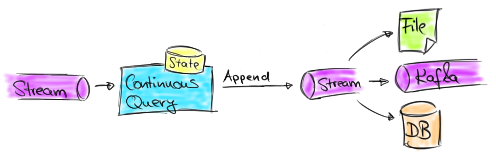
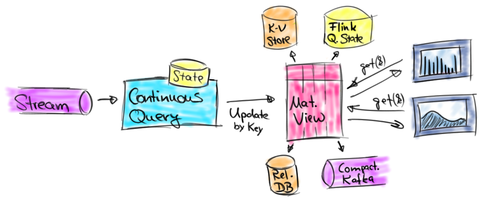
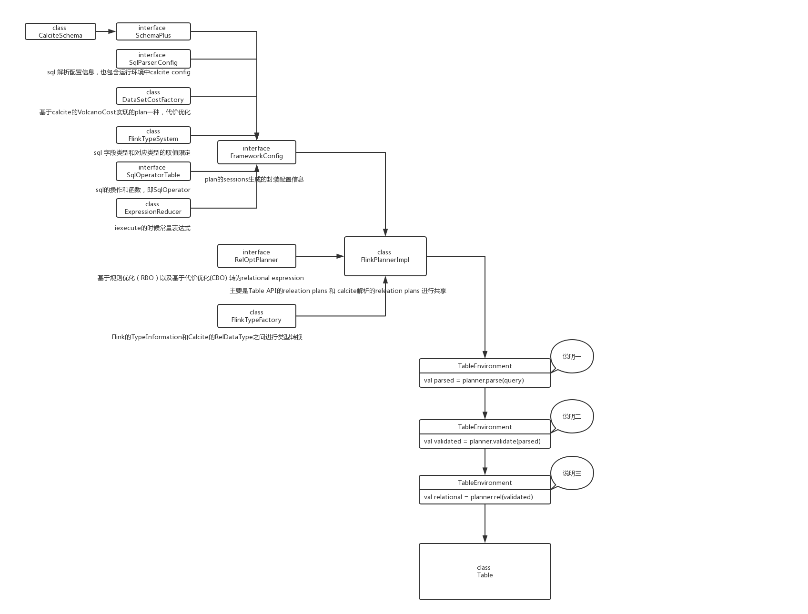
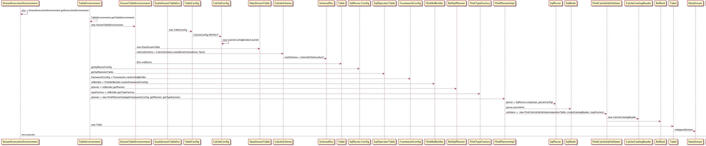

&emsp;&emsp;阅读本文大概需要3分钟，对应目录内容如下：
>1.背景

>2.SQL作用流核心理论知识
* 2.1 流表对偶性
* 2.2 动态表与持续查询
* 2.3 Early Emit&Retraction
>3.核心代码分析
* 3.1 环境准备
* 3.2 DataStream注册
* 3.3 SQL评估
* 3.4 Table转换

### 1. 背景
&emsp;&emsp;Apache Flink是目前最火的大数据技术组件之一，不仅仅是因为Flink在流处理的优势，也是因为Flink SQL处理流数据的特性。相比较采用API开发方式，抛开程序开发依赖程序员的经验外，对数据安全，集群安全，平台任务审核等都具有很大的挑战。因为SQL语言具有声明式，易理解，稳定可靠，自动优化等优势，所以越来越多的公司选择SQL为统一的开发规范，流计算开发平台的标准语言，不仅加速了实时计算业务场景的落地，也是未来发展的一种趋势。
SQL究竟是怎样作用到流数据上面的了？ 我们通过问题驱动，从理论和核心代码两方面进行阐述说明。

### 2. SQL作用流的理论知识
&emsp;&emsp;通常我们认为SQL能够作用与流数据，是因为下面几个方面：
#### 2.1 流表对偶性
&emsp;&emsp;SQL都是作用在数据库表的，进行查询的时候数据是不会变化的，即查询的是一张静态数据内容的表，按照大数据有界流和无界流的划分，相当于是一个有界流，是一个有限的批数据。 如果把无界流通过时间切片，那Flink SQL查询的就是一个有界流，这样就和静态数据内容的查询没什么区别。说明流数据通过时间切片，和表转换没有任何信息损坏。从特征角度来看：
* 表特征：Scheam，Data，数据操作时间
* 流特征：Scheam，Data，Time

&emsp;&emsp;只要我们找到对数据操作或者是切片的时间，则流和表是等价的，具有对偶性。

#### 2.2 动态表与持续查询
&emsp;&emsp;在流表对偶性我们提到，通常的SQL作用于静态数据，可以认为是一张静态表。但是在流数据中，数据持续不断的产生，而表的形成是通过数据操作或者切片时间，可以认为是动态表，是随着时间变化的。
基于动态表的查询，应该是连续不断的，即Continuous Query。 流数据，动态表，持续查询三者的关系如下图：




&emsp;&emsp;简单总结就是：流数据转变为动态表，对动态表的持续查询生成新的动态表（结果表），然后结果表被转换为流数据输出。

#### 2.3 Early Emit和Retraction
&emsp;&emsp;Early Emit保障流计算的低延时需求，将计算结果尽早发出到下游。由于流计算的结果会随着时间改变，因此当前时间计算的结果虽然发到下游是正确的，但在随后产生新的结果时，下游之前接受的计算结果就是错误的。
Retraction解决的就是这一问题，为了保障流计算语义正确性，将Early Emit的计算结果撤回并发出正确的计算结果。

&emsp;&emsp;这部分内容简单概括为：

* 流表对偶性：流表转化的理论支撑，流和表才能互转
* 动态表：抽象为动态表，SQL才能作用与流数据，进行持续查询
* 持续查询：持续查询才能解释流数据上的SQL计算永远不结束，结果永远在更新
* Early Emit&Retraction：Early Emit 才能够使计算无限接近秒级毫秒级的低延时；Retraction 保证流上语义的正确性

### 3. 核心代码分析

#### 3.1 环境准备
&emsp;&emsp;Flink程序的运行，通常我们都会设置程序执行环境StreamExecutionEnvironment，如standalone模式的LocalStreamEnvironment 或者提交到cluster执行的RemoteStreamEnvironment。而StreamSQL的运行则依赖StreamTableEnvironment，StreamTableEnvironment(继承TableEnvironment)创建代码：  
```scala
val env:StreamExecutionEnvironment = StreamExecutionEnvironment.getExecutionEnvironment  
val tEnv:StreamTableEnvironment = TableEnvironment.getTableEnvironment(env)  
```
&emsp;&emsp;getTableEnvironment方法中，其实就是新建一个StreamTableEnvironment对象  
```scala
new StreamTableEnvironment(executionEnvironment,new TableConfig())  
```
&emsp;&emsp;在这里也新建了TableConfig，主要是Flink 的Table API运行前的配置信息。这里主要关注Calcite对Table API或者SQL query的配置信息CalciteConfig，CalciteConfig主要是存储RuleSet信息，包含：
* normRuleSets标准规则
* logicalOptRuleSets逻辑执行规则
* physicalOptRuleSets物理执行规则
* decoRuleSets基于代价优化的执行规则
* SQL 解析的配置SqlParser.Config
* SQL操作和函数的SqlOperatorTable。  

&emsp;&emsp;SqlParser.Config，SqlOperatorTable实际在TableEnvironment中FrameConfig的时候新创建的，Planner使用的就是就是从FrameConfig获取。  

#### 3.2 DataStream注册
&emsp;&emsp;以StreamTableEnvironment(继承TableEnvironment)的registerDataStream为例，该方法是将DataStream注册到catalog（Calcite通过 CatalogReader被validator和planner读取table metadata）。详细的源码内容有：  
 ```scala
 // class StreamTableEnvironment  
 def registerDataStream[T](name:String,dataStream:DataStream[T],fields:Expression*):Unit={
   //名称检查，如不能是_DataStreamTable_1等命名
   checkValidTableName(name)
   registerDataStreamInternal(name,dataStream.javaStream,fields.toArray)
  }
```
&emsp;&emsp;registerDataStreamInternal主要处理：  
* 抽取字段类型，字段名称，字段角标  
* 验证取dataStream的字段有没有rowtime，proctime，如果有，并注入到字段名称列表和字段角标列表  
* 通过dataStream，字段名称列表，字段角标列表创建DataStreamTable，实际就是calcite的Table  
* catalog添加表约束，实际代码如下：  
 ```scala
 //class TableEnvironment
 private val internalSchema:CalciteSchema=CalciteSchema.createRootSchema(true,false)
 private val rootSchema:SchemaPlus=internalSchema.plus()
 protected def registerTableInternal(name:String,table:AbstractTable):Unit={
   if(isRegistered(name)){
      thrownewTableException(s"Table\'$name\'alreadyexists."+s"Please,chooseadifferentname.")
   }else{
      rootSchema.add(name,table)  //这里是重点
   }
 }
 //判断表已经注册
 protected[flink] def isRegistered(name:String):Boolean={
   rootSchema.getTableNames.contains(name)
 }
 ```
&emsp;&emsp;在这里有个两个类，CalciteSchema和SchemaPlus都是calcite的原生API，CalciteSchema是用户自定义schema被calcite使用的包装器类，保存Flink所有注册和转化的表，同时禁用了缓存防止副作用。SchemaPlus是Schema接口的丰富，主要提供用户自定义schema或者table的添加，和访问已经添加成功的tables。SchemaPlus只能被用户使用，但是不能由用户实例化，目的是以只读的方式向用户公开Calcite注册的schema额外信息。

#### 3.3 SQL评估
&emsp;&emsp;SQL语句主要通过TableEnvironment的sqlQuery和sqlUpdate函数进行评估，以sqlQuery为例，主要涵盖：  
* 创建执行计划对象FlinkPlannerImpl，该类是Flink自己实现替代calcite的PlannerImpl  
* 解析sql语句，返回SqlNode,即解析的语法树  
* 验证SqlNode   
* SqlNode 转换生成RelRoot,即关系树，是关系表达式RelNode的集合，如SELECT name FROM emp ORDER BY empno DESC的关系树表示是：
```json
RelRoot:{
   rel: Sort($1DESC)
      Project(name,empno)
         TableScan(EMP)
          fields:[0]
   collation:[1DESC]
}      
 ```
&emsp;&emsp;其中Sort,Project,TableScan是关系表达式，即RelNode。  
* 关系表达式封装为逻辑执行计划LogicalRelNode，创建Flink的Table对象。  
&emsp;&emsp;代码中涉及类和对象，执行流程详细说明如下：

>说明一  
底层是calcite的SqlParser进行parse,返回SqlNode。SqlNode是sql的解析树，涵盖：  

    * SqlOperator：查询表达式，如distinct，+，-等  
    * SqlLiteral： 类型名称，如NULL，BOOLEAN,DECIMAL等  
    * SqlIdentifier：标识符，如foo.bar，id等  

>说明二  
采用FlinkCalciteSqlValidator，专门用于FlinkPlannerImpl进行语法树验证，是从Calcite 的CalciteSqlValidator复制过来。主要涉及：  

    * CatalogScope（实现了SqlValidatorScope接口）：主要是在解析语法树定位标识符的位置，如SqlQualified fqId=scope.fullyQualify(id)  
    * RelDataType ：RelDataType表示从relational expression 返回记录实体或者scalar expression ,如RecordType(BIGINT user, VARCHAR(65536) product, INTEGER amount)  
    * CalciteCatalogReader用于validator和planner读取calcite table的元数据   

>说明三  
RelRoot是逻辑执行计划树，含有：  

    * RelNode，即逻辑表达式，如LogicalUnion#6，Sort,Join,Project,Filter,Scan,Sample  
    * RelDataType：即记录实体，如RecordType(BIGINT user, VARCHAR(65536) product, INTEGER amount)  
    * SqlKind  sql节点类型，如Union  
    * RelCollation：物理的关系表达式  
    * 操作字段  

>说明四  
通过RelRoot获取逻辑表达式RelNode，然后封装为LogicalRelNode，是叶子节点类型,接着基于StreamSQL执行环境创建对象Table。  

#### 3.4 Table转换
&emsp;&emsp;Table除数据输出sink操作外，通常的转换操作有两种：
* 直接使用Table封装的API进行数据转换，如select,where等算子
* 转换为DataSet或者DataStream，使用DataStream的API进行转换操作

&emsp;&emsp;采用转换为DataStream的toAppendStream为例，详细内容有：  

    * TableConversions将table转化为DataStream或者DataSet，最终调用的是StreamTableEnvironment的translate方法  
    * translate方法的动作包括：  
       ** 通过table获取逻辑表达式RelNode  
       ** 逻辑表达式是的优化optimize，optimize方法做的是：  
                a. 基于子查询规则，表引用规则采用HepPlanner进行逻辑表达式优化。Calcite实现了两套Planner，HepPlanner和VolcanoPlanner。  
                b.描述执行计划decorPlan  
                c.转化time修饰符，通过RelTimeIndicatorConverter实现  
                d.正常的逻辑执行计划  
                e.优化逻辑执行计划，即VolcanoPlanner,Flink默认采用该Planner  
                f.优化物理执行计划  
                g.修饰优化后的计划，然后返回DataStream[CRow]  

    * 详细代码：
     //class StreamTableEnvironment
     protected def translate[A](
       table:Table,
       queryConfig:StreamQueryConfig,
       updatesAsRetraction:Boolean,
       withChangeFlag:Boolean)(implicittpe:TypeInformation[A]):DataStream[A]={
        val relNode=table.getRelNode
        val dataStreamPlan=optimize(relNode,updatesAsRetraction)  

        valrowType=getResultType(relNode,dataStreamPlan)

        translate(dataStreamPlan,rowType,queryConfig,withChangeFlag)
     }

     private[flink] def optimize(relNode: RelNode, updatesAsRetraction: Boolean): RelNode = {

       // 0. convert sub-queries before query decorrelation
       val convSubQueryPlan = runHepPlanner(
         HepMatchOrder.BOTTOM_UP, FlinkRuleSets.TABLE_SUBQUERY_RULES, relNode, relNode.getTraitSet)

       // 0. convert table references
       val fullRelNode = runHepPlanner(
         HepMatchOrder.BOTTOM_UP,
         FlinkRuleSets.TABLE_REF_RULES,
         convSubQueryPlan,
         relNode.getTraitSet)

       // 1. decorrelate
       val decorPlan = RelDecorrelator.decorrelateQuery(fullRelNode)

       // 2. convert time indicators
       val convPlan = RelTimeIndicatorConverter.convert(decorPlan, getRelBuilder.getRexBuilder)

       // 3. normalize the logical plan
       val normRuleSet = getNormRuleSet
       val normalizedPlan = if (normRuleSet.iterator().hasNext) {
         runHepPlanner(HepMatchOrder.BOTTOM_UP, normRuleSet, convPlan, convPlan.getTraitSet)
       } else {
         convPlan
       }

       // 4. optimize the logical Flink plan
       val logicalOptRuleSet = getLogicalOptRuleSet
       val logicalOutputProps = relNode.getTraitSet.replace(FlinkConventions.LOGICAL).simplify()
       val logicalPlan = if (logicalOptRuleSet.iterator().hasNext) {
         runVolcanoPlanner(logicalOptRuleSet, normalizedPlan, logicalOutputProps)
       } else {
         normalizedPlan
       }

       // 5. optimize the physical Flink plan
       val physicalOptRuleSet = getPhysicalOptRuleSet
       val physicalOutputProps = relNode.getTraitSet.replace(FlinkConventions.DATASTREAM).simplify()
       val physicalPlan = if (physicalOptRuleSet.iterator().hasNext) {
         runVolcanoPlanner(physicalOptRuleSet, logicalPlan, physicalOutputProps)
       } else {
         logicalPlan
       }

       // 6. decorate the optimized plan
       val decoRuleSet = getDecoRuleSet
       val decoratedPlan = if (decoRuleSet.iterator().hasNext) {
         val planToDecorate = if (updatesAsRetraction) {
           physicalPlan.copy(
             physicalPlan.getTraitSet.plus(new UpdateAsRetractionTrait(true)),
             physicalPlan.getInputs)
         } else {
           physicalPlan
         }
         runHepPlanner(
           HepMatchOrder.BOTTOM_UP,
           decoRuleSet,
           planToDecorate,
           planToDecorate.getTraitSet)
       } else {
         physicalPlan
       }

       decoratedPlan
     }
&emsp;&emsp;接下来是优化后的计划返回为DataStream[CRow]，详细代码：  
 ```scala
protected def translateToCRow(
  logicalPlan:RelNode,
  queryConfig:StreamQueryConfig):DataStream[CRow]={

   logicalPlan match{
      case node:DataStreamRel =>
         node.translateToPlan(this,queryConfig)
      case_=>
         throw TableException("CannotgenerateDataStreamduetoaninvalidlogicalplan."+
            "Thisisabugandshouldnothappen.Pleasefileanissue.")
   }
}

//trait DataStreamRel
def translateToPlan(
  tableEnv:StreamTableEnvironment,
  queryConfig:StreamQueryConfig):DataStream[CRow]
 ```  
&emsp;&emsp;这里的logicalPlan就是我们在说明四的逻辑表达式，如RelNode如果逻辑表达式是Union，则对应转换为实际的Flink执行的逻辑表达式DataStreamUnion（RelNode <-  FlinkRelNode  <-  DataStreamRel <-  DataStreamUnion），代码如下：  

```scala
//class DataStreamUnion(cluster:RelOptCluster,traitSet:RelTraitSet,leftNode:RelNode,rightNode:RelNode,schema:RowSchema)
override deftranslateToPlan(
  tableEnv:StreamTableEnvironment,
  queryConfig:StreamQueryConfig):DataStream[CRow]={

   val leftDataSet=left.asInstanceOf[DataStreamRel].translateToPlan(tableEnv,queryConfig)
   val rightDataSet=right.asInstanceOf[DataStreamRel].translateToPlan(tableEnv,queryConfig)
   leftDataSet.union(rightDataSet)
}
```  
&emsp;&emsp;单逻辑表达式实际就是FlatMap，即DataStreamCalc，通过他对应生成DataStream[CRow]，剩下就是DataStream的核心编程。对应的UM时序图如下：  



附： calcite的接口和类列表  

    CalciteConfig
    RuleSet  
    SqlOperatorTable
    SqlParser.Config  
    CalciteSchema  
    SchemaPlus  
    RelOptPlanner
    PlannerImpl
    CalciteCatalogReader  
    SqlNode
    RelRoot
    RelNode
    HepPlanner
    VolcanoPlanner
